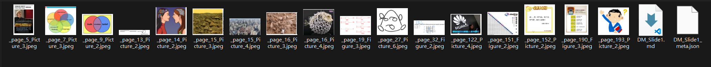
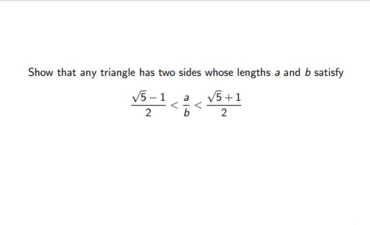

# Marker for NVIDIA RTX 50-series (sm_120)

## Description
This repository contains a custom `Dockerfile` to build an image for [datalab-to/marker](https://github.com/datalab-to/marker), specifically optimized to run on **NVIDIA RTX 50-series GPUs (Blackwell architecture, sm_120)**. By leveraging PyTorch Nightly with CUDA 12.8 support, this image unlocks the full hardware acceleration for the latest graphics cards while remaining backward compatible.

> **Prefer a pre-built image?** You can skip the build steps and pull the ready-to-use image from Docker Hub: `docker pull phototropicbird/marker-rtx50:latest`. Check out our [Docker Hub page](https://hub.docker.com/r/phototropicbird/marker-rtx50) for more details.

## Marker Intro
Marker is a powerful **local first AI** PDF conversion tool (to .md file specifically). Because it processes everything locally on your machine:
- There is **No token limitation** compared to cloud-based APIs.
- It is entirely **Offline available**, ensuring complete privacy for your sensitive documents.
- The conversion **Performance only depends on User's computer efficacy**. The better your GPU, the faster it runs!

### Powerful Image Extraction
Marker goes beyond plain text! When you convert a complex, image-heavy document (for example, taking a look at the results of `large-pdf-conatining-pics-result.pdf`), Marker intelligently **isolates and extracts the images** from the original PDF. It saves the images as independent files in your output folder and automatically **generates the correct image links directly inside the `.md` file**.

*Preview of the extracted result:*


### Mathematical Formula to LaTeX Support
Another incredible feature is its specialized mathematical handling. Marker is capable of detecting and accurately translating complex mathematical expressions and formulas from your PDFs straight into clean, beautifully formatted **LaTeX math symbols** within the resulting `.md` file. This makes it a perfect tool for converting academic and scientific papers!

*Preview of the extracted result:*


The result:
```markdown
Show that any triangle has two sides whose lengths a and b satisfy

$$\frac{\sqrt{5}-1}{2}<\frac{a}{b}<\frac{\sqrt{5}+1}{2}$$
```

## Hardware Requirements
- **GPU:** NVIDIA RTX 5070 or higher (also compatible with RTX 20/30/40 series).
- **Driver:** Latest NVIDIA Drivers (Version supporting CUDA 12.8+ recommended).
- **Environment:** Docker Desktop with **WSL 2** backend (Windows 10/11 required) or Linux environments with Docker and NVIDIA Container Toolkit.
- **RAM:** 16GB+ recommended.

---

## How to Build and Run Locally

These instructions guide you through cloning the repository, building the Docker image locally, and performing your first PDF conversion.

### 1. Clone the Repository
Clone this repository to your local machine and navigate into the folder:
```powershell
git clone https://github.com/your-username/marker-rtx50.git
cd marker-rtx50
```

### 2. Build the Docker Image
Build the Docker image. This process will pull a Python base image, install prerequisites, and configure the nightly builds of PyTorch and `marker-pdf`.
```powershell
docker build -t marker-rtx50:local .
```

### 3. Setup Directories
Next, set up the folders for your inputs, outputs, and the model cache. 
```powershell
mkdir input output marker-cache
```

- **`input/`**: Place the PDF you wish to convert (e.g., `test.pdf`) inside this folder. If you don't have one handy, you can download our [sample test.pdf](https://github.com/Phototropic-bird/marker-rtx50/raw/main/display/test-pdf/test.pdf) to test it out.
- **`output/`**: Your converted Markdown and extracted images will appear here.
- **`marker-cache/`**: This folder will store the AI model weights. **Crucial:** Mounting this prevents Docker from re-downloading ~10GB of models on every run.

### 4. Run the Conversion
Below is an example of running a single PDF conversion. We mount your current working directory (`$PWD`) to `/data` in the container and the cache folder to `/root/.cache`.

*Note: The first run will take some time as it needs to download the model weights (approx. 10GB).*

```powershell
docker run --rm -it --gpus all `
  -v "${PWD}:/data" `
  -v "${PWD}\marker-cache:/root/.cache" `
  marker-rtx50:local `
  marker_single /data/input/test.pdf /data/output
```

> **Tip:** Replace `test.pdf` with the actual name of your file in the `input` directory. Once the conversion is complete, check the `output` folder for your `.md` file!

#### CPU-Only Fallback
If your GPU is not compatible or you do not have an NVIDIA GPU, you can still use this image by simply removing the `--gpus all` flag from the command above. 
> **Note:** Running the AI models on a CPU will work, but the conversion process will be significantly slower.

---

## Legal Disclaimer
1. Nature of the Work
    - This Docker image (`phototropicbird/marker-rtx50`) is an unofficial, community-maintained distribution of the "Marker" project. It has been specifically modified to support NVIDIA Blackwell architecture (RTX 50-series GPUs) and utilize PyTorch Nightly builds.

2. Attribution and Non-Affiliation
    - Original Work: "Marker" is an open-source project originally developed by Viktor Kerkez and the Datalab community (available at [github.com/datalab-to/marker](https://github.com/datalab-to/marker)).
    - Non-Affiliation: The maintainer of this Docker image is not affiliated with, endorsed by, or sponsored by the original authors of the Marker project or the Datalab team. All trademarks and copyrights belong to their respective owners.

3. Use at Your Own Risk
    - This software is provided "AS IS" and "WITH ALL FAULTS." The maintainer makes no representations or warranties of any kind concerning the safety, suitability, lack of viruses, inaccuracies, typographical errors, or other harmful components of this software. There are inherent dangers in the use of any software, and you are solely responsible for determining whether this Docker image is compatible with your equipment and other software installed on your equipment.

4. Limitation of Liability
    - In no event shall the maintainer be liable for any direct, indirect, punitive, special, incidental, or consequential damages, including, without limitation, those resulting from loss of use, data, or profits, arising out of or in connection with the use or performance of this software, even if the maintainer has been advised of the possibility of such damages.

5. Educational and Research Use Only
    - This image is provided exclusively for educational, academic, and research purposes. Users are responsible for ensuring that their use of this tool, and the data processed by it, complies with the original project's license (e.g., GNU GPL) and any applicable local laws or third-party terms of service.
